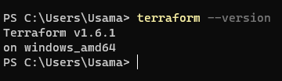

### Terraform Task

For reviewing the practical task files visit **Terraform** directory.

## Installation
For installation of terraform in windows follow the bellow instruction:
* Go to terraform download page. (https://developer.hashicorp.com/terraform/downloads?product_intent=terraform)
* Download the amd version it will be a zip file.
* Unzip it and copy the floder and paste it in C drive.
* After that go to edit environment and add the path.
* To make sure terraform install in your system check the version in Powershell.

## Version
For getting the version of the terraform installed on the system use the command below:
``` sh
 terraform --version
```

